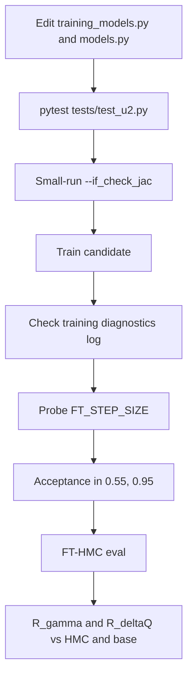
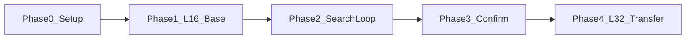

# L=16 U(2) FTHMC Architecture Search Plan

This document is the runbook for fast architecture search on a small lattice before committing to full L=32 production runs. The L=16 **train β=10 `base`** production baseline (gauge → train → HMC/FT-HMC eval) is already in place and analyzed via [`presentation/2du2_scaling.ipynb`](../2du2_scaling.ipynb). Architecture search iterates on CNN design, loss function, and training hyperparameters, ranking candidates against that baseline.

## 1. Goal and non-goals

**Goal:** Find FTHMC field-transformation designs that beat the L=16 train-β=10 `base` model on evaluation metrics **R_gamma(16)** and **R_deltaQ**, after passing all correctness gates.

**Non-goals:**

- L=32 confirmation (separate Phase 4, run only after a winner is chosen on L=16)
- Gauge generation (already available: `2du2/configs/links_L16_beta10.0.npy`)
- Re-running the production HMC / FT-HMC `base` grid (already generated via [`2du2/evaluation/hmc/gen_sub.sh`](../../2du2/evaluation/hmc/gen_sub.sh) and [`2du2/evaluation/base/gen_sub.sh`](../../2du2/evaluation/base/gen_sub.sh))

## 2. Experimental grid

| Parameter | Value |
|-----------|-------|
| Lattice size L | 16 |
| Train β | 10.0 |
| Eval β | 10, 12, 14, 16 |
| `train_beta` at eval | 10.0 |
| HMC / FT-HMC `n_steps` | 10 |
| HMC `n_configs` | 2048 (step size tuned, target accept ~0.70) |
| FT-HMC `n_configs` | 2048 (fixed `ft_step_size=0.10` for production `base`) |
| Training data | `2du2/configs/links_L16_beta10.0.npy` |

- **Primary ranking β:** 10.0 (on-coupling with train β)
- **Secondary β:** 12, 14, 16 (robustness under stronger coupling)
- **HMC baselines:** L=16, β ∈ {10, 12, 14, 16}, 8 seeds (`1029`, `1107`, `1331`, `1984`, `1999`, `2008`, `2017`, `2025`) — dumps under `2du2/evaluation/hmc/dumps/`
- **FT-HMC `base` reference:** same grid, save tags `base_train_b10.0_L16_{seed}` — dumps under `2du2/evaluation/base/dumps/` (32/32 complete)

## 3. Editable vs frozen files

Training is PyTorch; FT-HMC evaluation is JAX. New architecture tags must be registered in **both** model registries.

| File | Status | What may change |
|------|--------|-----------------|
| [`src/nthmc/u2/training_models.py`](../../src/nthmc/u2/training_models.py) | **Editable** | CNN architecture, `NetConfig`, new `model_tag` entries in `choose_model` (training) |
| [`src/nthmc/u2/training.py`](../../src/nthmc/u2/training.py) | **Editable** | Loss function, `hyperparams` defaults, training-side helpers |
| [`src/nthmc/u2/models.py`](../../src/nthmc/u2/models.py) | **Editable (eval mirror)** | JAX twin of any new `model_tag` so `compare_fthmc.py` can load checkpoints |
| [`src/nthmc/u2/field_transform.py`](../../src/nthmc/u2/field_transform.py) | **Mostly frozen** | JAX eval geometry / inverse / force runtime; do not change loop geometry without tests |
| [`2du2/model_training/train.py`](../../2du2/model_training/train.py) | **Editable** | CLI wiring for new hyperparams (e.g. `--align_weight`) |

Training and evaluation imports:

```python
# 2du2/model_training/train.py
from nthmc.u2.training import FieldTransformation

# 2du2/evaluation/*/compare_fthmc.py
from nthmc.u2.field_transform import FieldTransformation  # JAX
```

Before the first architecture edit, snapshot `training_models.py` + `training.py` + `models.py` (git branch or tag) for rollback.

### Allowed optimization surface

**In `training_models.py` (+ JAX `models.py` mirror):**

- New `nn.Module` / JAX model classes and `choose_model` tags
- `NetConfig`: `hidden_channels`, `kernel_size`, depth, multiscale branches
- Coefficient caps, `_LayerScale` / `out_scale` gain
- Existing registered starting point: **`base` only** (reintroduce tags such as `cap` / `mscap` if needed)

**In `training.py`:**

- `hyperparams` defaults and new keys (passed via CLI in `train.py`)
- `loss_fn` and helpers: `_weighted_force_loss_*`, stubbed topology alignment (~lines 948–954), new regularizers
- Do **not** change core loop/Jacobian geometry unless `tests/test_u2.py` is extended

**Hyperparams wired via CLI** (`2du2/model_training/train.py`):

- `--lr`, `--weight_decay`, `--max_grad_norm`
- `--loss_weights` (4-tuple: w2, w4, w6, w8)
- `--plateau_patience`, `--early_stop_patience`

### Hard constraints on CNN I/O

Enforced in training and eval coefficient paths:

- **Input:** 6 plaquette + 12 rectangle scalar channels per lattice site
- **Output:** 16 plaquette + 32 rectangle coefficient channels (4 slots × loop count)
- Coefficients must stay within tanh caps (reversibility); output gate starts at identity (zero `out_scale` / `_LayerScale`)
- Do **not** change `plaq_loop_count`, `rect_loop_count`, `coeff_slots_per_loop`, or attached-loop geometry without extending Jacobian tests

## 4. Success metrics

Definitions match [`presentation/2du2_scaling.ipynb`](../2du2_scaling.ipynb).

### R_gamma(16)

Integrated autocorrelation time ratio at lag 16 (notebook convention: FT-HMC improvement appears as values **> 1**):

```
A(δ) = 1 - <ΔQ²(δ)> / (2V)        # V = L²
gamma(δ) = 1 / (1 - A(δ))
R_gamma(16) = gamma_HMC(16) / gamma_FT(16)
           = (1 - A_fthmc[16]) / (1 - A_hmc[16])
```

**Better when > 1** (FT-HMC decorrelates topology faster than HMC).

### R_deltaQ

Mean absolute topology step size ratio:

```
deltaQ = mean(|diff(topo)|)
R_deltaQ = <deltaQ>_fthmc / <deltaQ>_hmc
```

**Better when > 1** (FT-HMC takes larger topological steps).

### Analysis settings

- `GAMMA_LAG = 16`, `MAX_LAG = 64`
- Jackknife over seeds (notebook `collect_one`, `average_pair_with_jackknife`)
- Production `base` paths:

```python
HMC_DUMP_DIR = REPO_ROOT / "2du2" / "evaluation" / "hmc" / "dumps"
FTHMC_DUMP_DIR = REPO_ROOT / "2du2" / "evaluation" / "base" / "dumps"
MODEL_TAG = "base"
TRAIN_BETA = 10.0
LATTICE_SIZES = [16]
BETAS = [10.0, 12.0, 14.0, 16.0]
SEEDS = [1029, 1107, 1331, 1984, 1999, 2008, 2017, 2025]
```

For a candidate, point `FTHMC_DUMP_DIR` / `MODEL_TAG` at that candidate's eval folder and tag.

### Win rule

A candidate **beats base** at the same (β, n_steps, seed set) when:

1. **R_gamma(16) > base** and **R_deltaQ > base** at primary eval β=10 (both also > 1 vs HMC), and
2. At least one metric has jackknife error bars that do not overlap base at ≤1σ (soft gate for T1/T2), or
3. At T3: both metrics beat base with ≥3 seeds and clear separation

A candidate that improves only one metric while regressing on the other is **not** promoted unless explicitly documented as a trade-off study.

### Current production `base` reference (2026-07-21)

Computed with the notebook definitions from available HMC↔FT seed pairs. FT-HMC uses fixed `ft_step_size=0.10`.

| Eval β | Seeds paired | R_gamma(16) | R_deltaQ | HMC accept | FT accept |
|--------|--------------|-------------|----------|------------|-----------|
| 10.0 | 8/8 | 1.124(78) | 1.189(48) | 0.676 | 0.963 |
| 12.0 | 7/8 | 1.011(56) | 0.948(51) | 0.789 | 0.951 |
| 14.0 | 8/8 | 1.091(66) | 1.165(91) | 0.674 | 0.948 |
| 16.0 | 8/8 | 1.45(33) | 1.32(33) | 0.757 | 0.941 |

β=12 is provisional until HMC seed `2008` lands; then re-run the notebook (or recompute from dumps) to finalize that row. FT accept ≈ 0.94–0.96 leaves headroom to raise `ft_step_size` for candidates (and possibly for a retuned `base` probe).

## 5. Correctness gates

Every candidate must pass all gates before metrics are scored.



| Gate | Command / check | Pass criterion |
|------|-----------------|----------------|
| **G1 Unit tests** | `pytest tests/test_u2.py -k "field_transform"` | All pass (round-trip, Jacobian, gauge covariance as covered) |
| **G2 Jacobian check** | Short train with `--if_check_jac`, L=8 or L=16, 1 epoch, 1 GPU | No Jacobian mismatch errors |
| **G3 Training diagnostics** | Read epoch log from `maybe_log_training_diagnostics` | Inverse convergence OK; saturation fractions not pinned at 1.0 |
| **G4 Step-size probe** | Short FT-HMC sweep (see Section 8) | Find `ft_step_size` with acceptance ∈ [0.55, 0.95] |
| **G5 Formal eval acceptance** | T1/T2/T3 `compare_fthmc.py` run | Acceptance ∈ [0.55, 0.95] at chosen `FT_STEP_SIZE` |

Skip compile / CUDA-graph heavy paths during step-size probes when they OOM; prefer the production eval env flags already used in `base/gen_sub.sh`.

## 6. Tiered compute budget

| Tier | Purpose | Seeds | n_configs | n_epochs | GPUs |
|------|---------|-------|-----------|----------|------|
| **T0** | Correctness only | — | — | 1 | 1 + `--if_check_jac` |
| **T1** | Fast screen | 1 (`1029`) | 512 | 8–12 | 1–4 |
| **T2** | Rank candidates | 3 (`1029`, `1331`, `1999`) | 1024 | 16 | 4 |
| **T3** | Confirm winner | 8 (full pool) | 2048 | 16 | 4 |

- L=16 **base** production reference is already at **full 8-seed / 2048-config** coverage (treat as the ranking floor)
- T3 only for top 1–2 candidates

### Naming conventions

**Training checkpoints** (`2du2/artifacts/models/`):

```
{model_tag}_train_b10.0_L16_{seed}
best_model_train_beta10.0_{model_tag}_train_b10.0_L16_{seed}.{pt,npz}
```

**Evaluation topology dumps** (`2du2/evaluation/<eval_tag>/dumps/`):

```
topo_fthmc_L16_beta{beta}_nsteps10_{save_tag}.csv
accept_rate_fthmc_L16_beta{beta}_nsteps10_{save_tag}.csv
```

**HMC baselines** (`2du2/evaluation/hmc/dumps/`, from `hmc/gen_sub.sh`):

```
topo_hmc_L16_beta{beta}_nsteps10_{seed}.csv
accept_rate_hmc_L16_beta{beta}_nsteps10_{seed}.csv
```

Seeds: `1029`, `1107`, `1331`, `1984`, `1999`, `2008`, `2017`, `2025`. No additional HMC jobs are required for architecture search.

## 7. Evaluation directories

There is no `add_folder.sh` in the current tree. Create candidate workspaces by copying the canonical [`2du2/evaluation/base/`](../../2du2/evaluation/base/) layout.

### Create a folder

```bash
cd 2du2/evaluation
cp -a base l16_search          # or l16_<model_tag>
# then edit l16_search/gen_sub.sh: model_tag, ft_step_size, paths
```

Keep `compare_fthmc.py` in sync with `evaluation/base/compare_fthmc.py` unless a candidate needs local CLI changes.

| `gen_sub.sh` field | L=16 search value |
|--------------------|-------------------|
| `lattice_size` | 16 |
| `train_beta` | 10.0 |
| `n_steps` | 10 |
| `model_tag` | candidate `model_tag` |
| PBS `-o` / logs | `2du2/evaluation/<eval_tag>/` |
| `ft_step_size` | Set **only after** probe (Section 8); production base used `0.10` |
| `n_configs` | Tier-appropriate (512 / 1024 / 2048) |
| `tune_step_size` | `false` + `--no_tune_step_size` (fixed step from probe) |

### Folder naming

| Folder tag | Purpose | When |
|------------|---------|------|
| `base` | Production train-β=10 base reference (do not overwrite during search) | Phase 1 done |
| `l16_search` | Fast T1/T2 candidate screening | Phase 2 |
| `l16_<model_tag>` | Dedicated folder per promoted candidate | T2/T3 |

HMC baselines stay in `2du2/evaluation/hmc/` (shared). When analyzing candidates in `2du2_scaling.ipynb`, set `FTHMC_DUMP_DIR` / `MODEL_TAG` to the candidate folder and tag; keep `HMC_DUMP_DIR` and `TRAIN_BETA = 10.0`.

## 8. FT_STEP_SIZE probe (mandatory)

**Every** formal FT-HMC run at a new `(model_tag, beta, L)` combination requires a step-size probe first. Do not copy production `base` `FT_STEP_SIZE=0.10` blindly for a new architecture — but use it as the lower starting hint (production accept is already ~0.95).

### Probe procedure

1. Load the trained checkpoint (`save_tag`, `train_beta=10.0`)
2. From the candidate's eval folder, run short `compare_fthmc.py`:

```bash
cd 2du2/evaluation/l16_search   # or candidate folder
python compare_fthmc.py \
    --lattice_size 16 \
    --train_beta 10.0 \
    --beta 10.0 \
    --n_configs 128 \
    --n_steps 10 \
    --ft_step_size 0.12 \
    --max_lag 64 \
    --rand_seed 1029 \
    --model_tag base \
    --save_tag base_train_b10.0_L16_1029 \
    --device cuda \
    --no_tune_step_size
```

3. Sweep `--ft_step_size` until acceptance lands in **[0.55, 0.95]**
4. Read `dumps/accept_rate_fthmc_L16_beta*_nsteps10_*.csv`
5. Record the chosen value in the **step-size log** (Section 12); use it in `gen_sub.sh` for T1/T2/T3

**Probe settings:** `n_configs` 128, single seed `1029`. (Acceptance from probe is coarse; T1 at 512 configs re-validates before scoring R_gamma / R_deltaQ.)

### Starting sweep hints (L=16, train β=10)

| Eval β | Starting `ft_step_size` sweep |
|--------|--------------------------------|
| 10 | 0.10, 0.12, 0.14, 0.16 |
| 12 | 0.10, 0.12, 0.14 |
| 14 | 0.08, 0.10, 0.12 |
| 16 | 0.08, 0.10, 0.12 |

Production `base` at `ft_step_size=0.10` sits at FT accept ≈ 0.94–0.96 across the grid — often above the upper gate edge. For fair metric comparison, either (a) keep a common step and report accept, or (b) retune each candidate into [0.55, 0.95] and record the probed value. Prefer **(b)** for cross-candidate ranking.

If no value hits the acceptance window, the candidate is **not ready for metric comparison** — adjust the transform or training, then re-probe.

## 9. Phase-by-phase workflow



### Phase 0 — Setup

- [x] Generate `2du2/configs/links_L16_beta10.0.npy`
- [x] L=16 HMC baselines at eval β ∈ {10, 12, 14, 16} via `evaluation/hmc/gen_sub.sh` (8 seeds; β=12 seed 2008 finishing)
- [x] Production eval workspace: `evaluation/base/` + `gen_sub.sh`
- [ ] Git branch/tag snapshot of `training_models.py` + `training.py` + `models.py` before first search edit

### Phase 1 — L=16 base reference

- [x] Train `model_tag=base` on L=16 β=10 (16 epochs, 8 seeds)
- [x] Production FT-HMC in `evaluation/base/` at all eval βs (`ft_step_size=0.10`, 2048 configs, 8 seeds)
- [x] Record baseline **R_gamma(16)** and **R_deltaQ** table (Section 4; finalize β=12 after last HMC dump)

### Phase 2 — Agent search loop

See Section 11. Use `l16_search/` (or per-candidate folders). Compare every candidate against Phase 1 baseline.

### Phase 3 — Confirm winner

- [ ] T3 eval for top 1–2 candidates in dedicated eval folder
- [ ] All eval βs, 8 seeds, 2048 configs
- [ ] Both R_gamma(16) and R_deltaQ beat `base` at β=10 with ≥3 seeds

### Phase 4 — L=32 transfer (optional)

- [ ] Retrain winner on L=32 β=10 with current training stack
- [ ] Eval at stronger couplings using a copied `evaluation/<tag>/` pipeline
- [ ] Keep Torch train / JAX eval registries in sync

## 10. Optimization directions (candidate families)

Four orthogonal directions for the search. Each targets a different mechanism, so candidates do not overlap and results stay interpretable. Search each direction mostly on its own; only combine a winning architecture with a winning loss after both are validated alone.

| Dir | Lever | Primary file | New `model_tag` / flag | Targets | Cost |
|-----|-------|--------------|------------------------|---------|------|
| D1 | Receptive field / multiscale | [`training_models.py`](../../src/nthmc/u2/training_models.py) + JAX [`models.py`](../../src/nthmc/u2/models.py) | new tag (e.g. `deep`) | R_gamma(16) | T1 (heavier) |
| D2 | Coefficient caps + gate gain | same | new tag (e.g. `cap`) | R_deltaQ | cheap T1 |
| D3 | Force-tail loss shaping | [`train.py`](../../2du2/model_training/train.py) CLI | `--loss_weights` (no model edit) | acceptance → R_gamma | cheapest |
| D4 | Topology-directed loss | [`training.py`](../../src/nthmc/u2/training.py) | `--align_weight` (new CLI) | R_gamma & R_deltaQ | T1 |

### D1 — Long-range / multiscale receptive field

- **Hypothesis:** topological barriers correlate over distances larger than the base receptive field (`LocalNet` 3×3×2 conv ≈ 5 sites). A larger effective RF lets the transform reshape the action across the whole tunneling region.
- **Mechanism:** spatial expressivity.
- **Change:** add a new model class + `choose_model` tag in **both** Torch and JAX registries — residual stack of circular 3×3 convs (depth 3–4), optionally a dilation pyramid. Reuse split heads, tanh caps, GELU, and zero-init output gate so it still starts at identity.
- **Risk:** at L=16 a too-large RF wraps the torus and over-smooths; watch G3 saturation and inverse convergence.

### D2 — Coefficient cap & gate strength

- **Hypothesis:** the base caps (plaq `tanh/5 = 0.2`, rect `tanh/40 = 0.025`) may be too conservative or mis-balanced; a stronger but still reversible transform takes larger topological steps.
- **Mechanism:** output parametrization (transform magnitude).
- **Change:** new `model_tag` sweeping plaquette/rectangle caps and output-gate gain. Tags such as historical `cap` / `wide` / `mscap` are **not** currently registered — reintroduce them explicitly in both registries if used. Forward-path only — the tanh squash preserves reversibility by construction.
- **Risk:** too-large caps degrade inverse-iteration convergence (G3) and acceptance (G4/G5).

### D3 — Force-tail loss shaping (CLI-only)

- **Hypothesis:** acceptance at a fixed `ft_step_size` is limited by the worst-case forces, not the mean. Up-weighting the higher-order norms (L6/L8 in `_weighted_force_loss_*`) flattens the force tail, allowing a larger usable step size and faster topology mixing.
- **Mechanism:** loss objective (tail control); no model-code edit.
- **Change:** sweep `--loss_weights` (e.g. `1 1 1 1` baseline vs `0.5 1 1.5 2` tail-heavy vs `0 0 1 1` tail-only) together with `--lr`, `--weight_decay`, `--max_grad_norm`. Applies to any `model_tag`.
- **Risk:** over-weighting the tail destabilizes training; watch grad norm and test loss vs base at the same tier.

### D4 — Topology-directed loss term

- **Hypothesis:** minimizing the force norm only indirectly helps topology. Explicitly aligning the transformed force with the soft-topology gradient steers MD trajectories along topology-changing directions — a direct proxy for the goal metrics.
- **Mechanism:** loss objective (topology-directed).
- **Change:** re-enable the stubbed path in `training.py` `loss_fn` (commented near the `_force_topology_alignment_loss` call) using `compute_transformed_force_and_topology_grad`; add an `align_weight` hyperparam key (default `0.0`, so base behavior is unchanged) and a matching `--align_weight` CLI flag in `train.py`. Optionally tune `second_harmonic` in `_soft_topology_from_plaquettes`.
- **Gate note:** training-only path (no Jacobian change → G2 unaffected), but extend `tests/test_u2.py` (G1) to cover the new loss branch.
- **Risk:** the competing objective can raise the force norm and lower acceptance; tune `align_weight` against R_deltaQ / acceptance.

## 11. Agent iteration loop

For each candidate `model_tag`:

1. **Implement** in `training_models.py` **and** mirror in JAX `models.py` (+ register in both `choose_model`s)
2. **Optionally tune** `loss_fn` / `hyperparams` in `training.py`
3. **T0 gates:** `pytest` + `--if_check_jac` short run
4. **Train** at appropriate tier (T1 screen → T2 if promising)
5. **Eval folder:** copy `evaluation/base/` → candidate folder; adapt `gen_sub.sh`
6. **Probe `FT_STEP_SIZE`** at β=10 first, then per-β before T2/T3
7. **FT-HMC eval** only after acceptance OK
8. **Compute** R_gamma(16), R_deltaQ vs HMC and vs production `base`
9. **Promote** to T2/T3 if metrics beat baseline
10. **Log** in tables below (include probed `FT_STEP_SIZE`)

### Suggested search order (cheap → expressive)

1. **D3** (force-tail loss shaping) — CLI-only sweep on `base`; establishes how much acceptance headroom comes from the loss alone.
2. **D2** (caps + gate gain) — cheap forward-path tags; reintroduce as needed.
3. **D1** (receptive field / multiscale) — new architecture tag; heavier, run after D2/D3 narrow the loss + caps.
4. **D4** (topology-directed loss) — objective experiment; layer on the best D1–D3 configuration once each is validated alone.

### Promotion criteria (T1 → T2)

- Passes G1–G5 at β=10
- Test loss not divergent vs base at same tier
- R_gamma(16) or R_deltaQ beats production `base` at β=10, without regression >10% on the other metric

### Promotion criteria (T2 → T3)

- Both R_gamma(16) and R_deltaQ beat `base` at β=10 (3 seeds)
- Acceptance OK at β=12 and β=14

## 12. Result logging templates

Maintain these tables in this file (append rows) or in a companion `optimization_log.md`.

Older train-β=8 / `l16_*` / `wide|cap|mscap` search rows are **superseded** by the train-β=10 production baseline below and are not carried forward.

### Step-size log

| model_tag | beta | ft_step_size | accept_rate | n_configs | seed pool | pass | notes |
|-----------|------|--------------|-------------|-----------|-----------|------|-------|
| base | 10.0 | 0.10 | 0.963 | 2048 | 8 seeds | yes* | production; accept above 0.95 soft edge |
| base | 12.0 | 0.10 | 0.951 | 2048 | 8 seeds | borderline | production |
| base | 14.0 | 0.10 | 0.948 | 2048 | 8 seeds | yes | production |
| base | 16.0 | 0.10 | 0.941 | 2048 | 8 seeds | yes | production |

\*Production `base` intentionally kept at a common `ft_step_size=0.10` for the scaling notebook. New candidates should probe into [0.55, 0.95].

### Results log

| run_id | eval_tag | model_tag | ft_step_size | accept β=10 | R_gamma(16) β=10 | R_deltaQ β=10 | R_gamma β=12 | R_deltaQ β=12 | R_gamma β=14 | R_deltaQ β=14 | R_gamma β=16 | R_deltaQ β=16 | notes |
|--------|----------|-----------|--------------|-------------|------------------|---------------|--------------|---------------|--------------|---------------|--------------|---------------|-------|
| base_ref | base | base | 0.10 | 0.963 | 1.124(78) | 1.189(48) | 1.011(56)* | 0.948(51)* | 1.091(66) | 1.165(91) | 1.45(33) | 1.32(33) | train β=10; *β12 uses 7/8 seeds pending HMC 2008 |

Add candidate rows below as search proceeds.

## 13. Pitfalls

- **Torch/JAX dual registry:** a new `model_tag` in `training_models.py` without a JAX twin in `models.py` trains but cannot evaluate
- **L=16 receptive field:** base 3×3×2 conv has RF=5 sites ≈ 31% of L — locality changes may behave differently than at L=32 (16%)
- **Coupling grid:** train β=10, eval β≥10; poor high-β robustness is a failure mode, not noise
- **Skipping FT_STEP_SIZE probe** invalidates cross-candidate comparison
- **Do not overwrite `evaluation/base/` dumps** during search — copy to a new folder
- **Checkpoint incompatibility** across architecture changes — always use a new `save_tag`
- **`inf` ratios:** when HMC autocorrelation at lag 16 ≈ 1, R_gamma diverges (see notebook `gamma_ratio_from_autocorrelations`)
- **High base accept at step 0.10:** retuning candidates to a lower accept (larger step) may change the fair comparison vs the published `base_ref` table — document the choice

## 14. Quick reference commands

### Training (T2 example)

```bash
cd 2du2/model_training
torchrun --standalone --nproc_per_node=4 train.py \
    --lattice_size 16 --min_beta 10.0 --max_beta 10.0 --beta_gap 0.5 \
    --n_epochs 16 --batch_size 64 --n_subsets 8 \
    --model_tag base --save_tag base_train_b10.0_L16_1029 --rand_seed 1029 \
    --lr 1e-3 --max_grad_norm 5 \
    --plateau_patience 2 --early_stop_patience 5 \
    --loss_weights 1 1 1 1 \
    --data_parallel
```

### Correctness (T0)

```bash
pytest tests/test_u2.py -k "field_transform"
```

### Analyze results (notebook)

Adapt the constants in `presentation/2du2_scaling.ipynb` as listed in Section 4 / Section 7 (`HMC_DUMP_DIR`, `FTHMC_DUMP_DIR`, `MODEL_TAG`, `TRAIN_BETA`, `LATTICE_SIZES`, `BETAS`, `SEEDS`).
