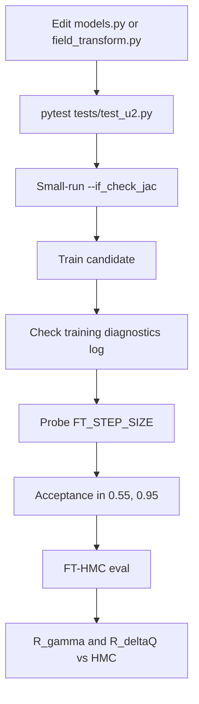
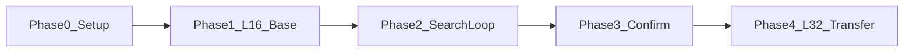

# L=16 U(2) FTHMC Architecture Search Plan

This document is the runbook for fast architecture search on a small lattice before committing to full L=32 production runs. The L=32 pipeline is already validated; this plan uses L=16 as a proxy sandbox to iterate on CNN design, loss function, and training hyperparameters.

## 1. Goal and non-goals

**Goal:** Find FTHMC field-transformation designs that beat the L=16 `base` model on evaluation metrics **R_gamma(16)** and **R_deltaQ**, after passing all correctness gates.

**Non-goals:**

- L=32 confirmation (separate Phase 4, run only after a winner is chosen on L=16)
- Gauge generation (handled manually upstream)
- L=16 HMC baseline runs (pre-submitted via [`2du2/evaluation/hmc/sub_L16.sh`](../2du2/evaluation/hmc/sub_L16.sh))

## 2. Experimental grid

| Parameter | Value |
|-----------|-------|
| Lattice size L | 16 |
| Train β | 8.0 |
| Eval β | 10, 12, 14, 16 |
| `train_beta` at eval | 8.0 (OOD extrapolation, mirroring L=32 train β=10 / eval β≥13) |
| HMC / FT-HMC `n_steps` | 10 |
| Training data | `2du2/configs/links_L16_beta8.0.npy` |

- **Primary ranking β:** 10.0 (closest eval coupling to train β=8)
- **Secondary β:** 12, 14, 16 (robustness under stronger coupling extrapolation)
- **HMC baselines (ready):** L=16, β ∈ {10, 12, 14, 16}, 8 seeds (`1029`, `1107`, `1331`, `1984`, `1999`, `2008`, `2017`, `2025`), `n_configs=4096`, `n_steps=10`, `step_size=0.16` — submitted via [`2du2/evaluation/hmc/sub_L16.sh`](../2du2/evaluation/hmc/sub_L16.sh). Dumps: `2du2/evaluation/hmc/dumps/topo_hmc_L16_beta{beta}_nsteps10_{seed}.csv`

## 3. Editable vs frozen files

| File | Status | What may change |
|------|--------|-----------------|
| [`src/nthmc/u2/models.py`](../src/nthmc/u2/models.py) | **Editable** | CNN architecture, `NetConfig`, new `model_tag` entries in `choose_model` |
| [`src/nthmc/u2/field_transform.py`](../src/nthmc/u2/field_transform.py) | **Editable** | Loss function, `hyperparams` defaults, training-side helpers |
| [`src/nthmc/u2/field_transform_ref.py`](../src/nthmc/u2/field_transform_ref.py) | **Frozen** | Read-only snapshot for rollback comparison; do not modify |

Training and evaluation already import the production module directly:

```python
# 2du2/model_training/train.py
from nthmc.u2.field_transform import FieldTransformation
```

No import swap is needed. Before the first edit, snapshot `field_transform.py` state (git branch or tag) for rollback.

### Allowed optimization surface

**In `models.py`:**

- New `nn.Module` classes and `choose_model` tags
- `NetConfig`: `hidden_channels`, `kernel_size`, depth, multiscale branches
- Coefficient heads, tanh caps, `_LayerScale` gain
- Existing starting points: `base`, `wide`, `cap`, `mscap`

**In `field_transform.py`:**

- `hyperparams` defaults and new keys (passed via CLI in `train.py`)
- `loss_fn` and helpers: `_weighted_force_loss_tensor`, `_force_topology_alignment_loss` (stubbed at lines 923–939), new regularizers
- Do **not** change core loop/Jacobian geometry unless `tests/test_u2.py` is extended

**Hyperparams wired via CLI** (`2du2/model_training/train.py`):

- `--lr`, `--weight_decay`, `--max_grad_norm`
- `--loss_weights` (4-tuple: w2, w4, w6, w8)
- `--plateau_patience`, `--early_stop_patience`

### Hard constraints on CNN I/O

Enforced in `field_transform.py` `compute_coefficients`:

- **Input:** 6 plaquette + 12 rectangle scalar channels per lattice site
- **Output:** 16 plaquette + 32 rectangle coefficient channels (4 slots × loop count)
- Coefficients must stay within tanh caps (reversibility); `_LayerScale` starts at identity
- Do **not** change `plaq_loop_count`, `rect_loop_count`, `coeff_slots_per_loop`, or attached-loop geometry without extending Jacobian tests

## 4. Success metrics

Definitions match [`presentation/2du2_scaling.ipynb`](2du2_scaling.ipynb).

### R_gamma(16)

Integrated autocorrelation time ratio at lag 16:

```
A(δ) = 1 - <ΔQ²(δ)> / (2V)        # V = L²
gamma(δ) = 1 / (1 - A(δ))
R_gamma(16) = gamma_fthmc(16) / gamma_hmc(16)
           = (1 - A_fthmc[16]) / (1 - A_hmc[16])
```

**Better when > 1** (FT-HMC decorrelates topology faster than HMC).

### R_deltaQ

Mean absolute topology step size ratio:

```
deltaQ = mean(|diff(topo)|)
R_deltaQ = <deltaQ>_fthmc / <deltaQ>_hmc
```

**Better when > 1** (FT-HMC takes larger topological steps).

### Analysis settings

- `GAMMA_LAG = 16`, `MAX_LAG = 64`
- Jackknife over seeds (see notebook `collect_one`, `average_pair_with_jackknife`)
- Point `FTHMC_DUMP_DIR` in the notebook at the correct eval folder tag (e.g. `2du2/evaluation/l16_base/dumps`)

### Win rule

A candidate **beats base** at the same (β, n_steps, seed set) when:

1. **R_gamma(16) > 1** and **R_deltaQ > 1** at primary eval β=10, and
2. At least one metric has jackknife error bars that do not overlap base at ≤1σ (soft gate for T1/T2), or
3. At T3: both metrics > 1 with ≥3 seeds and clear separation

A candidate that improves only one metric while regressing on the other is **not** promoted unless explicitly documented as a trade-off study.

## 5. Correctness gates

Every candidate must pass all gates before metrics are scored.



| Gate | Command / check | Pass criterion |
|------|-----------------|----------------|
| **G1 Unit tests** | `pytest tests/test_u2.py -k "field_transform"` | All pass (round-trip, Jacobian manual vs autograd, gauge covariance) |
| **G2 Jacobian check** | Short train with `--if_check_jac`, L=8 or L=16, 1 epoch, 1 GPU | No Jacobian mismatch errors |
| **G3 Training diagnostics** | Read epoch log from `maybe_log_training_diagnostics` | `n_subsets_not_converged=0`; `max_final_diff` ~ 1e-6; `k0_sat_frac`, `k1_sat_frac` not pinned at 1.0 |
| **G4 Step-size probe** | Short FT-HMC sweep (see Section 8) | Find `ft_step_size` with acceptance ∈ [0.55, 0.95] |
| **G5 Formal eval acceptance** | T1/T2/T3 `compare_fthmc.py` run | Acceptance ∈ [0.55, 0.95] at chosen `FT_STEP_SIZE` |

**Do not** use `--if_compile` with `--if_check_jac`. Skip `--if_compile` during step-size probes.

## 6. Tiered compute budget

| Tier | Purpose | Seeds | n_configs | n_epochs | GPUs |
|------|---------|-------|-----------|----------|------|
| **T0** | Correctness only | — | — | 1 | 1 + `--if_check_jac` |
| **T1** | Fast screen | 1 (`1029`) | 512 | 8–12 | 1–4 |
| **T2** | Rank candidates | 3 (`1029`, `1331`, `1999`) | 1024 | 16 | 4 |
| **T3** | Confirm winner | 8 (full pool) | 2048 | 16 | 4 |

- L=16 **base** reference must reach **T2** before any winner is declared
- T3 only for top 1–2 candidates

### Naming conventions

**Training checkpoints** (`2du2/artifacts/models/`):

```
{model_tag}_train_b8.0_L16_{seed}
```

**Evaluation topology dumps** (`2du2/evaluation/<eval_tag>/dumps/`):

```
topo_fthmc_L16_beta{beta}_nsteps10_{save_tag}.csv
accept_rate_fthmc_L16_beta{beta}_nsteps10_{save_tag}.csv
```

**HMC baselines** (`2du2/evaluation/hmc/dumps/`, produced by `sub_L16.sh`):

```
topo_hmc_L16_beta{beta}_nsteps10_{seed}.csv
accept_rate_hmc_L16_beta{beta}_nsteps10_{seed}.csv
```

Seeds: `1029`, `1107`, `1331`, `1984`, `1999`, `2008`, `2017`, `2025`. No additional HMC jobs are required for this search plan.

## 7. Evaluation directories (`add_folder.sh`)

Use [`2du2/evaluation/add_folder.sh`](../2du2/evaluation/add_folder.sh) to create **temporary search/test workspaces**. Do not write search artifacts into `evaluation/base/` during iteration.

### Create a folder

```bash
cd 2du2/evaluation
bash add_folder.sh l16_base      # L=16 baseline reference eval
bash add_folder.sh l16_search    # candidate screening
# optional per promoted candidate:
bash add_folder.sh l16_wide
```

`add_folder.sh` scaffolds `dumps/`, `logs/`, `plots/`, `scripts/` only. **After creation:**

1. Copy [`2du2/evaluation/base/compare_fthmc.py`](../2du2/evaluation/base/compare_fthmc.py) into the new folder (same pattern as [`evaluation/mscap/`](../2du2/evaluation/mscap/))
2. Add a `sub_gen.sh` adapted from [`2du2/evaluation/base/sub_gen.sh`](../2du2/evaluation/base/sub_gen.sh):

| `sub_gen.sh` field | L=16 search value |
|--------------------|-------------------|
| `LATTICE_SIZE` | 16 |
| `TRAIN_BETA` | 8.0 |
| `N_STEPS` | 10 |
| `MODEL_TAG` | folder tag or candidate `model_tag` |
| `WORKDIR` / PBS `-o` | `2du2/evaluation/<eval_tag>/` |
| `FT_STEP_SIZE` | Set **only after** probe (Section 8) |
| `N_CONFIGS` | Tier-appropriate (512 / 1024 / 2048) |
| CLI flags | `--no_tune_step_size` (fixed step from probe) |

### Folder naming

| Folder tag | Purpose | When |
|------------|---------|------|
| `l16_base` | L=16 base model reference metrics | Phase 1 |
| `l16_search` | Fast T1/T2 candidate screening | Phase 2 |
| `l16_<model_tag>` | Dedicated folder per promoted candidate | T2/T3 |

HMC baselines stay in `2du2/evaluation/hmc/` (shared; already populated by `sub_L16.sh`). When analyzing results in `2du2_scaling.ipynb`, set:

```python
HMC_DUMP_DIR = REPO_ROOT / "2du2" / "evaluation" / "hmc" / "dumps"
FTHMC_DUMP_DIR = REPO_ROOT / "2du2" / "evaluation" / "l16_base" / "dumps"  # or l16_search, etc.
MODEL_TAG = "base"  # the --model_tag used in compare_fthmc.py, not necessarily the folder name
TRAIN_BETA = 8.0
LATTICE_SIZES = [16]
BETAS = [10.0, 12.0, 14.0, 16.0]
SEEDS = [1029, 1107, 1331, 1984, 1999, 2008, 2017, 2025]  # match sub_L16.sh
```

## 8. FT_STEP_SIZE probe (mandatory)

**Every** formal FT-HMC run at a new `(model_tag, beta, L)` combination requires a step-size probe first. Do not copy L=32 `FT_STEP_SIZE=0.08` blindly.

### Probe procedure

1. Load the trained checkpoint (`save_tag`, `train_beta=8.0`)
2. From the candidate's eval folder, run short `compare_fthmc.py`:

```bash
cd 2du2/evaluation/l16_search   # or l16_base, etc.
python compare_fthmc.py \
    --lattice_size 16 \
    --train_beta 8.0 \
    --beta 10.0 \
    --n_configs 128 \
    --n_steps 10 \
    --ft_step_size 0.17 \
    --max_lag 64 \
    --rand_seed 1029 \
    --model_tag base \
    --save_tag base_train_b8.0_L16_1029 \
    --device cuda \
    --no_tune_step_size
```

3. Sweep `--ft_step_size` until acceptance lands in **[0.55, 0.95]**
4. Read `dumps/accept_rate_fthmc_L16_beta*_nsteps10_*.csv`
5. Record the chosen value in the **step-size log** (Section 12); use it in `sub_gen.sh` for T1/T2/T3

**Probe settings:** `n_configs` 128, single seed `1029`, no `--if_compile`. (Acceptance from probe is coarse; T1 at 512 configs re-validates before scoring R_gamma / R_deltaQ.)

### Starting sweep hints (L=16)

| Eval β | Starting `ft_step_size` sweep |
|--------|--------------------------------|
| 8 (sanity) | 0.17 (checked-in default in `run_scaling.sh`) |
| 10 | 0.15, 0.17, 0.19, 0.21 |
| 12 | 0.12, 0.14, 0.16, 0.17 |
| 14 | 0.10, 0.12, 0.14, 0.15 |
| 16 | 0.08, 0.10, 0.12 |

If no value hits the acceptance window, the candidate is **not ready for metric comparison** — adjust the transform or training, then re-probe.

### HMC baselines (pre-run)

L=16 standard HMC at eval β ∈ {10, 12, 14, 16} is **already covered** by [`2du2/evaluation/hmc/sub_L16.sh`](../2du2/evaluation/hmc/sub_L16.sh) (`step_size=0.16`, 4096 configs, 8 seeds). Architecture search only needs to probe **FT-HMC** `ft_step_size` (Section 8).

## 9. Phase-by-phase workflow



### Phase 0 — Setup

- [ ] Generate `2du2/configs/links_L16_beta8.0.npy` (user-handled)
- [x] L=16 HMC baselines at eval β ∈ {10, 12, 14, 16} — submitted via `evaluation/hmc/sub_L16.sh` (8 seeds)
- [ ] `bash add_folder.sh l16_base`; copy `compare_fthmc.py`; write `sub_gen.sh`
- [ ] Git branch/tag snapshot of `field_transform.py` + `models.py` before first edit

### Phase 1 — L=16 base reference

- [ ] Train `model_tag=base` on L=16 β=8 (T2: 16 epochs, 4 GPU, seeds 1029/1331/1999)
- [ ] Probe `FT_STEP_SIZE` per eval β for base
- [ ] Run T2 FT-HMC in `l16_base/` at all eval βs
- [ ] Record baseline **R_gamma(16)** and **R_deltaQ** table (all β, all seeds)

### Phase 2 — Agent search loop

See Section 11. Use `l16_search/` (or per-candidate folders). Compare every candidate against Phase 1 baseline.

### Phase 3 — Confirm winner

- [ ] T3 eval for top 1–2 candidates in dedicated eval folder
- [ ] All eval βs, 8 seeds, 2048 configs
- [ ] Both R_gamma(16) > 1 and R_deltaQ > 1 vs `l16_base` at β=10 with ≥3 seeds

### Phase 4 — L=32 transfer (optional)

- [ ] Retrain winner on L=32 β=10 with current `field_transform.py` + `models.py`
- [ ] Eval at β=13+ using existing `evaluation/base/` pipeline
- [ ] No merge from `field_transform_ref.py` needed

## 10. Optimization directions (candidate families)

Four orthogonal directions for the search. Each targets a different mechanism, so candidates do not overlap and results stay interpretable. Search each direction mostly on its own; only combine a winning architecture with a winning loss after both are validated alone.

| Dir | Lever | Primary file | New `model_tag` / flag | Targets | Cost |
|-----|-------|--------------|------------------------|---------|------|
| D1 | Receptive field / multiscale | [`models.py`](../src/nthmc/u2/models.py) | new tag (e.g. `deep`) | R_gamma(16) | T1 (heavier) |
| D2 | Coefficient caps + gate gain | [`models.py`](../src/nthmc/u2/models.py) | new tag (e.g. `cap2`) | R_deltaQ | cheap T1 |
| D3 | Force-tail loss shaping | [`train.py`](../2du2/model_training/train.py) CLI | `--loss_weights` (no code edit) | acceptance → R_gamma | cheapest |
| D4 | Topology-directed loss | [`field_transform.py`](../src/nthmc/u2/field_transform.py) | `--align_weight` (new) | R_gamma & R_deltaQ | T1 |

### D1 — Long-range / multiscale receptive field

- **Hypothesis:** topological barriers correlate over distances larger than the base receptive field (`LocalNet` 3×3×2 conv ≈ 5 sites). A larger effective RF lets the transform reshape the action across the whole tunneling region.
- **Mechanism:** spatial expressivity.
- **Change:** add a new `nn.Module` + `choose_model` tag — a residual stack of `padding_mode="circular"` 3×3 convs (depth 3–4), optionally a dilation pyramid. Reuse the split heads, the 90% caps, GELU, and the zero-init `_LayerScale` so it still starts at identity. Start from `MultiScaleCapLocalNet` (`mscap`), which already mixes local / dilated / point branches.
- **Risk:** at L=16 a too-large RF wraps the torus and over-smooths; watch G3 saturation (`k0_sat_frac`, `k1_sat_frac`) and inverse convergence.

### D2 — Coefficient cap & gate strength

- **Hypothesis:** the base caps (plaq `tanh/5 = 0.2`, rect `tanh/40 = 0.025`) may be too conservative or mis-balanced; a stronger but still reversible transform takes larger topological steps.
- **Mechanism:** output parametrization (transform magnitude).
- **Change:** new `model_tag` sweeping `plaq_cap` / `rect_cap` (via `_scale_split_coefficients`) and `_LayerScale(gain=...)`. Existing reference points: `cap` (0.1125 / 0.05625), `wide` (gain 0.9), `mscap` (gain 0.8). Forward-path only — the tanh squash preserves reversibility by construction.
- **Risk:** too-large caps degrade inverse-iteration convergence (G3 `n_subsets_not_converged`, `max_final_diff`) and acceptance (G4/G5).

### D3 — Force-tail loss shaping (CLI-only)

- **Hypothesis:** acceptance at a fixed `ft_step_size` is limited by the worst-case forces, not the mean. Up-weighting the higher-order norms (L6/L8 in `_weighted_force_loss_tensor`) flattens the force tail, allowing a larger usable step size and faster topology mixing.
- **Mechanism:** loss objective (tail control); no code edit.
- **Change:** sweep `--loss_weights` (e.g. `1 1 1 1` baseline vs `0.5 1 1.5 2` tail-heavy vs `0 0 1 1` tail-only) together with `--lr`, `--weight_decay`, `--max_grad_norm`. Applies to any `model_tag`.
- **Risk:** over-weighting the tail destabilizes training; watch grad norm and test loss vs base at the same tier.

### D4 — Topology-directed loss term

- **Hypothesis:** minimizing the force norm only indirectly helps topology. Explicitly aligning the transformed force with the soft-topology gradient steers MD trajectories along topology-changing directions — a direct proxy for the goal metrics.
- **Mechanism:** loss objective (topology-directed).
- **Change:** re-enable the stubbed path in `loss_fn` (commented at lines ~927–933) using `compute_transformed_force_and_topology_grad` + `_force_topology_alignment_loss`; add an `align_weight` hyperparam key (default `0.0`, so base behavior is unchanged) and a matching `--align_weight` CLI flag in `train.py`. Optionally tune `second_harmonic` in `_soft_topology_from_plaquettes`.
- **Gate note:** training-only path (no Jacobian change → G2 unaffected), but extend `tests/test_u2.py` (G1) to cover the new loss branch.
- **Risk:** the competing objective can raise the force norm and lower acceptance; tune `align_weight` against R_deltaQ / acceptance.

## 11. Agent iteration loop

For each candidate `model_tag`:

1. **Implement** in `models.py` (+ register in `choose_model`)
2. **Optionally tune** `loss_fn` / `hyperparams` in `field_transform.py`
3. **T0 gates:** `pytest` + `--if_check_jac` short run
4. **Train** at appropriate tier (T1 screen → T2 if promising)
5. **Eval folder:** `add_folder.sh` if new tag; copy `compare_fthmc.py` + `sub_gen.sh`
6. **Probe `FT_STEP_SIZE`** at β=10 first, then per-β before T2/T3
7. **FT-HMC eval** only after acceptance OK
8. **Compute** R_gamma(16), R_deltaQ vs HMC and vs `l16_base`
9. **Promote** to T2/T3 if metrics beat baseline
10. **Log** in tables below (include probed `FT_STEP_SIZE`)

### Suggested search order (cheap → expressive)

Run the directions from Section 10 cheapest first:

1. **D3** (force-tail loss shaping) — CLI-only sweep on `base`; establishes how much acceptance headroom comes from the loss alone.
2. **D2** (caps + gate gain) — cheap forward-path tags; start from `cap` / `mscap`.
3. **D1** (receptive field / multiscale) — new architecture tag; heavier, run after D2/D3 narrow the loss + caps.
4. **D4** (topology-directed loss) — objective experiment; layer on the best D1–D3 configuration once each is validated alone.

### Promotion criteria (T1 → T2)

- Passes G1–G5 at β=10
- Test loss not divergent vs base at same tier
- R_gamma(16) > 1 **or** R_deltaQ > 1 at β=10, without regression >10% on the other metric

### Promotion criteria (T2 → T3)

- Both R_gamma(16) > 1 and R_deltaQ > 1 at β=10 (3 seeds)
- Acceptance OK at β=12 and β=14

## 12. Result logging templates

Maintain these tables in this file (append rows) or in a companion `optimization_log.md`.

### Step-size log

| model_tag | beta | ft_step_size | accept_rate | n_configs_probe | seed | pass |
|-----------|------|--------------|-------------|-----------------|------|------|
| base | 10.0 | 0.15 | 0.71875 | 32 | 1029 | yes |
| base | 12.0 | 0.14 | 0.62500 | 32 | 1029 | yes |
| base | 14.0 | 0.14 | 0.56250 | 32 | 1029 | yes |
| base | 16.0 | 0.12 | 0.68750 | 32 | 1029 | yes |

### Results log

| run_id | eval_tag | model_tag | ft_step_size β=10 | train_loss | accept β=10 | R_gamma(16) β=10 | R_deltaQ β=10 | R_gamma β=12 | R_deltaQ β=12 | pass T0 | notes |
|--------|----------|-----------|-------------------|------------|-------------|------------------|---------------|--------------|---------------|---------|-------|
| base_ref | l16_base | base | 0.15 | 22.267659 | 0.552734 | 1.151(39) | 0.987(28) | pending | pending | yes | T2 seeds 1029/1331/1999 at β=10; β=12 missing seed 1331 rerun; β=14: R_gamma 1.39(41), R_deltaQ 1.53(43); β=16: R_gamma 0.847(64), R_deltaQ 1.03(28) |
| d3_lw0011 | l16_search | base | pending probe | 10.660200 | pending | pending | pending | — | — | yes | D3 `--loss_weights 0 0 1 1`; β=10 probe jobs submitted for ft_step_size 0.15/0.17/0.19 |
| d2_cap | l16_search | cap | pending | pending | pending | pending | pending | — | — | pending | D2 cap/gate candidate; L=16 β=8 seed 1029 T1 training submitted |
| d2_mscap | l16_search | mscap | pending | pending | pending | pending | pending | — | — | pending | D2/D1 multiscale cap candidate; L=16 β=8 seed 1029 T1 training submitted |

Add columns for β=14, β=16 at T2/T3 as needed.

## 13. Pitfalls

- **L=16 receptive field:** base 3×3×2 conv has RF=5 sites ≈ 31% of L — locality changes may behave differently than at L=32 (16%)
- **OOD extrapolation:** train β=8, eval β≥10; poor extrapolation is a failure mode, not noise
- **Skipping FT_STEP_SIZE probe** invalidates cross-candidate comparison
- **`add_folder.sh` does not copy `compare_fthmc.py`** — forgetting this breaks eval
- **Checkpoint incompatibility** across architecture changes — always use a new `save_tag`
- **`inf` ratios:** when HMC autocorrelation at lag 16 ≈ 1, R_gamma diverges (see notebook `gamma_ratio_from_autocorrelations`)
- **`field_transform_ref.py` is off-limits** — do not edit during search

## 14. Quick reference commands

### Training (T2 example)

```bash
cd 2du2/model_training
python train.py \
    --lattice_size 16 --min_beta 8.0 --max_beta 8.0 --beta_gap 0.5 \
    --n_epochs 16 --batch_size 64 --n_subsets 8 --n_workers 0 \
    --model_tag base --save_tag base_train_b8.0_L16_1029 --rand_seed 1029 \
    --lr 1e-3 --max_grad_norm 5 \
    --plateau_patience 2 --early_stop_patience 5 \
    --loss_weights 1 1 1 1
```

### Correctness (T0)

```bash
pytest tests/test_u2.py -k "field_transform"
```

### Analyze results (notebook)

Adapt the constants in `presentation/2du2_scaling.ipynb` as listed in Section 7 (`HMC_DUMP_DIR`, `FTHMC_DUMP_DIR`, `MODEL_TAG`, `TRAIN_BETA`, `LATTICE_SIZES`, `BETAS`, `SEEDS`).
